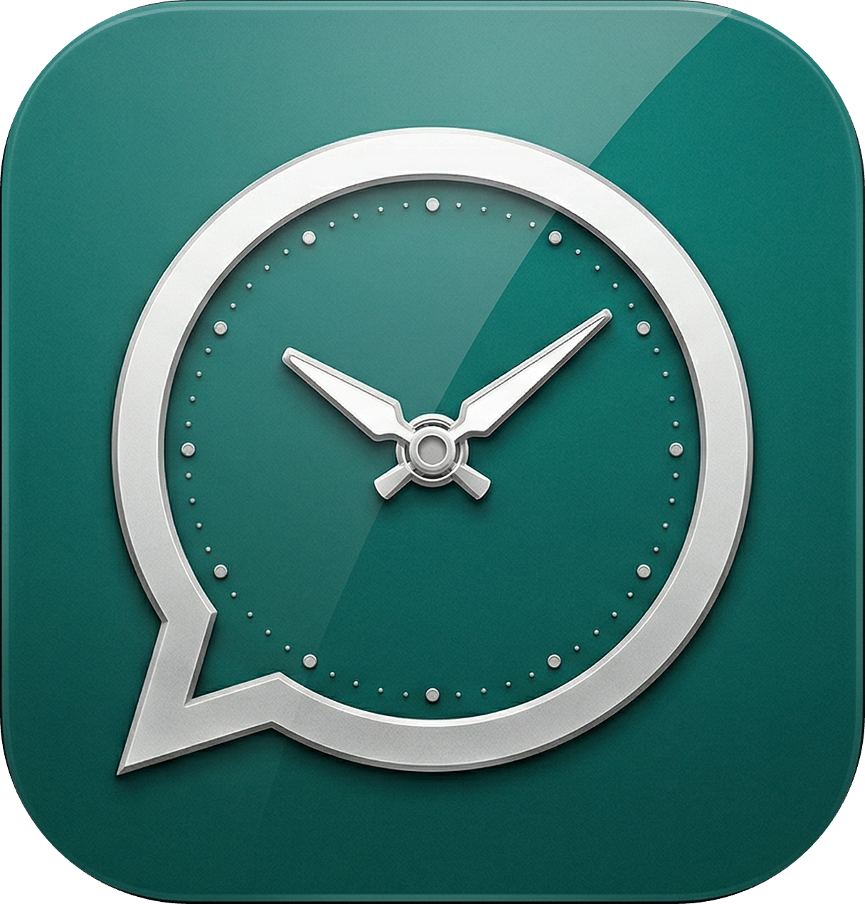

# WhaTime

<div align="center">
  
</div>

A local macOS desktop app for scheduling WhatsApp messages. No cloud backend, no unofficial APIs — just local scheduling + macOS automation.

## What It Does

**WhaTime** lets you schedule WhatsApp messages to be sent automatically at specific times. Perfect for:
- Sending reminders to contacts at scheduled times
- Daily/weekly recurring messages (motivation quotes, check-ins, reminders)
- One-time scheduled messages for later
- Quarterly, half-yearly, or yearly recurring messages
- Testing messages before they go live (Dry Run mode)

All scheduling happens locally on your Mac — no data leaves your computer.

## How It Works

### Scheduling
- The Electron main process runs `node-schedule` jobs in-memory
- Schedules are persisted in a local SQLite database (`~/Library/Application Support/whatsapp-text-scheduler/schedules.db`)
- On app startup, all enabled schedules are loaded and registered as jobs
- Supports one-time, daily, and weekly recurring schedules
- One-time schedules auto-disable after firing

### WhatsApp Sending
1. Opens the WhatsApp chat via the `whatsapp://send?phone=NUMBER&text=MESSAGE` URL scheme
2. Waits a configurable delay (default 3s) for WhatsApp to load the chat
3. Uses AppleScript + System Events to press Enter, sending the pre-filled message
4. Logs the result (success/failed/dry-run) to the run history

### Dry Run Mode
- Per-schedule or global toggle
- Opens WhatsApp with the message pre-filled but does NOT press Enter
- Lets you visually verify the message before enabling live sends

## User Interface

WhaTime features a clean, intuitive macOS-native interface built with React + Tailwind CSS:

### Dashboard
- **Schedule List** — View all your scheduled messages at a glance
- **Status Badges** — Shows if a schedule is enabled/disabled, with next fire time
- **Quick Actions** — Toggle, edit, duplicate, test, or delete schedules
- **Search & Filter** — Search by contact name, phone number, or message content
- **Sorting Options** — Sort by next fire time, contact name, creation date, or last updated
- **Skeleton Loading** — Smooth loading states while fetching data

### Schedule Creation Modal
- Enter recipient's **contact name** and **phone number**
- Type your **message** (displayed with character count)
- Choose **schedule type**: One-time, Daily, Weekly, Quarterly, Half-yearly, or Yearly
- Set **date/time** with date and time pickers
- Toggle **Dry Run** mode per-schedule
- Create button with confirmation

### Activity/Logs Tab
- View **execution history** for all scheduled messages
- See **success/failed/dry-run** status for each send
- Timestamps for when messages were sent (or attempted)
- Filter and search through past activity

### Settings Tab
- **Global Dry Run Toggle** — Test all messages without sending
- **Accessibility Check** — Verify your app has permission to send keystrokes
- **Quick link** to macOS System Settings for Accessibility permissions
- **App Status** — Displays current configuration and database state

## Tech Stack

| Layer | Technology |
|-------|-----------|
| Framework | Electron + electron-vite |
| Frontend | React 18 + TypeScript |
| Styling | Tailwind CSS + shadcn/ui components |
| Database | SQLite via better-sqlite3 |
| Scheduling | node-schedule (in-process cron) |
| Automation | AppleScript via osascript (child_process) |

### Why Electron?
- Direct Node.js access for `child_process` (osascript), native SQLite, and in-process scheduling
- No Rust toolchain needed (unlike Tauri)
- Standard debugging via Chrome DevTools
- Bundle size is irrelevant for a personal local utility

## Prerequisites

- **macOS** (Apple Silicon M1/M2/M3 or Intel)
- **Node.js 18+** (download from [nodejs.org](https://nodejs.org))
- **WhatsApp Desktop** installed and logged in ([download here](https://www.whatsapp.com/download))
- **Accessibility permission** granted to the app (required for sending keystrokes)

## Installation & Setup

### Step 1: Clone or Download the Project

```bash
# Clone the repository
git clone <repository-url> whatsapp-text-scheduler
cd whatsapp-text-scheduler
```

### Step 2: Install Dependencies

```bash
npm install
```

### Step 3: Rebuild Native Modules

WhaTime uses `better-sqlite3` which requires compilation for Electron:

```bash
npm run rebuild
```

### Step 4: Run in Development Mode

```bash
npm run dev
```

This will:
- Start the Electron app
- Open the WhaTime window with a fresh database at `~/Library/Application Support/whatsapp-text-scheduler/schedules.db`
- Hot-reload enabled for development

### Step 5: Grant Accessibility Permission

The app needs permission to send keystrokes to WhatsApp. Follow these steps:

1. **Open System Settings** on your Mac
2. Go to **Privacy & Security** → **Accessibility**
3. Click the lock icon to unlock changes
4. Click the **+** button and add the Electron app:
   - In dev mode: look for "Electron Helper"
   - After building: look for "WhaTime"
5. Toggle it **ON** in the list
6. You can verify this in WhaTime's **Settings tab** — there's a "Check" button that confirms permission

### Step 6: Create Your First Schedule

1. Click **New Schedule** or press **Cmd+N**
2. Enter a contact name and phone number (e.g., `+14155551234`)
3. Type your message
4. Choose a schedule type (One-time, Daily, Weekly, etc.)
5. Set the date/time
6. Optionally enable **Dry Run** to test first
7. Click **Create**

### Step 7: Test with Dry Run

1. Toggle **Dry Run** in Settings (or per-schedule)
2. Click the **Play button** on a schedule to test immediately
3. WhatsApp will open with your message pre-filled
4. Check the **Activity tab** to see the dry-run log
5. When confident, disable Dry Run and the schedule will send live

## Building for Production

To build a standalone macOS app:

```bash
npm run build
```

This creates a `.dmg` installer in the `dist/` folder. The built app:
- Runs as a standard macOS application
- Can be moved to `/Applications`
- Has the full WhaTime icon and branding
- Still requires Accessibility permission to send messages


## Known Limitations

- **Mac must be unlocked** and logged in for automation to work
- **WhatsApp Desktop must be running** and logged in
- **App must be running** for schedules to fire (no background daemon)
- **UI automation is fragile** — may break if WhatsApp changes its interface layout
- **Group messages not supported** — the URL scheme targets phone numbers only
- **No encryption** of local data (SQLite is plaintext on disk)
- **Not a replacement** for WhatsApp Business API — this is personal use only
- **Single recipient per schedule** — no broadcast/bulk messaging

## Project Structure

```
electron/                  # Main process (Node.js)
  main.ts                  # App entry, window, lifecycle
  preload.ts               # IPC context bridge
  ipc/                     # IPC handlers (schedule, logs, settings)
  services/
    db.service.ts          # SQLite CRUD operations
    scheduler.service.ts   # node-schedule job management
    whatsapp.service.ts    # AppleScript bridge + URL scheme
  utils/
    applescript.ts         # osascript wrapper
src/                       # Renderer (React)
  pages/                   # Dashboard, Logs, Settings
  components/              # ScheduleForm, ScheduleModal, StatusBadge
  hooks/                   # useSchedules, useLogs, useSettings
  lib/                     # IPC client, utilities
shared/
  types.ts                 # TypeScript types shared across IPC
```

